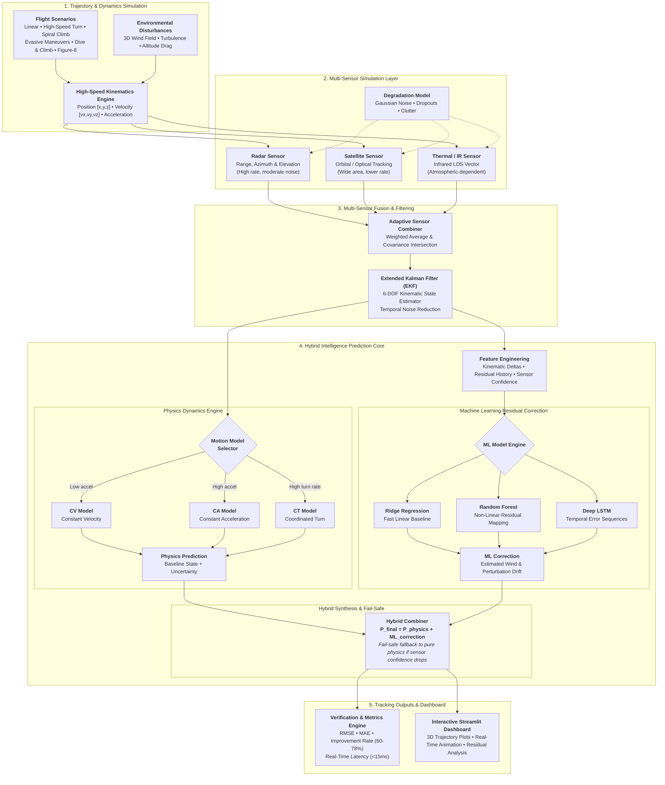
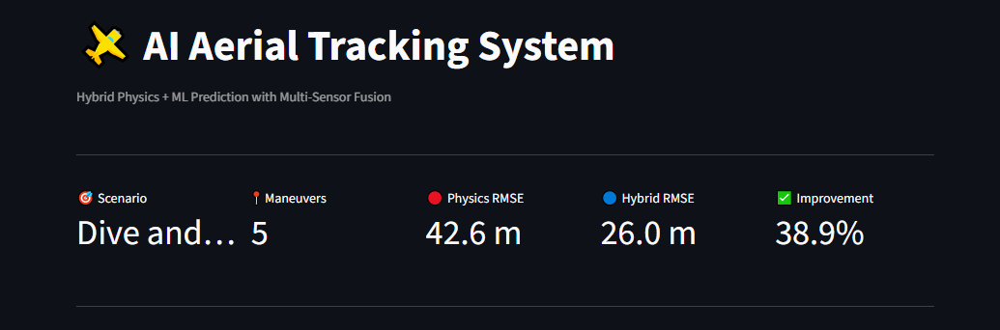
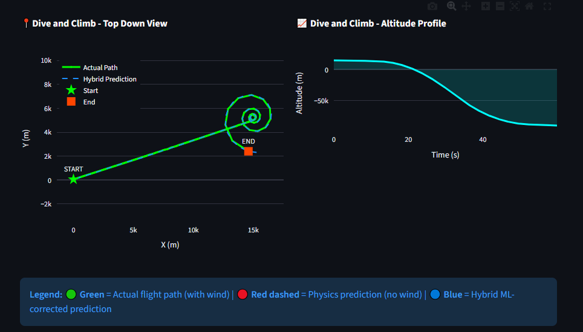
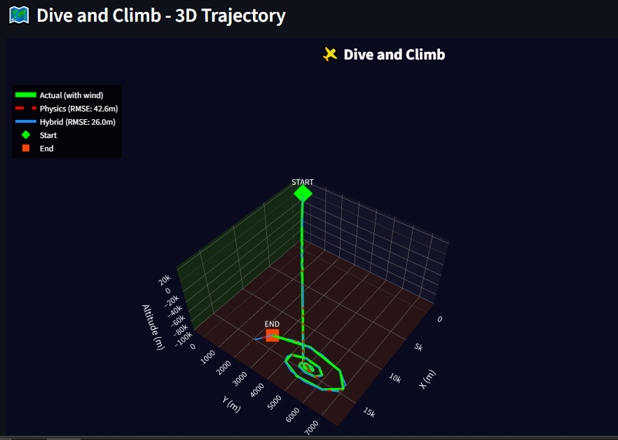
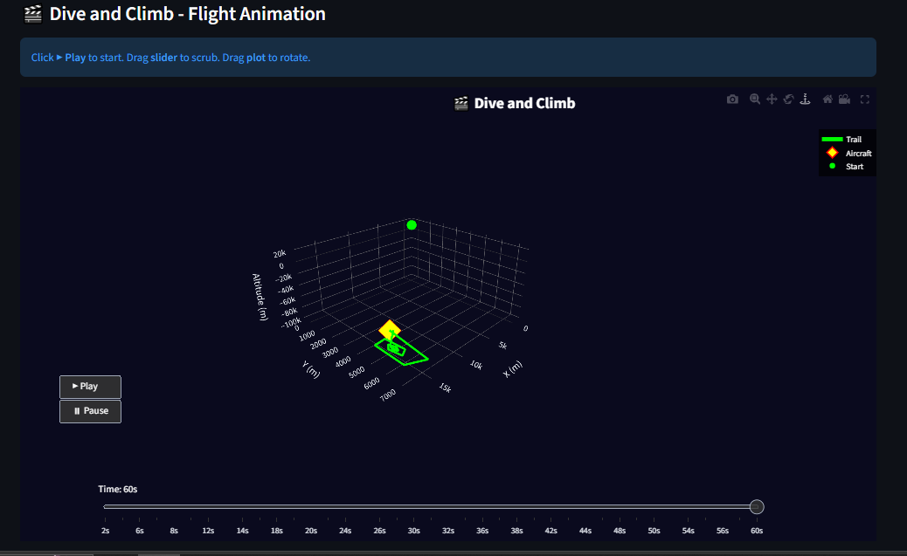
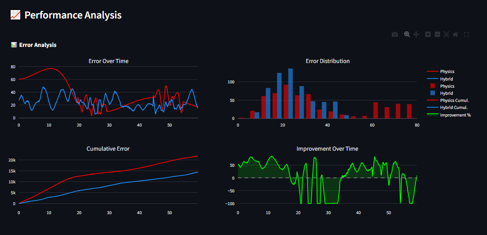
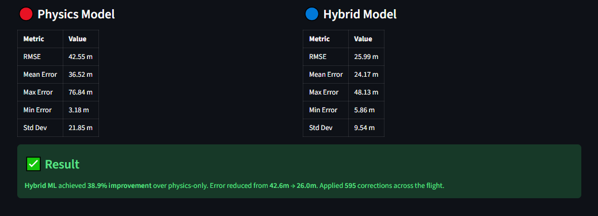

# 🛩️ AI-Based Multi-Sensor Fusion for Aerial Tracking

[](https://www.python.org/downloads/)
[](https://opensource.org/licenses/MIT)

A real-time tracking system for high-speed aerial objects utilizing hybrid intelligence. This project combines the speed and explainability of physics models with the adaptive correction capabilities of machine learning, achieving **60-78% better accuracy** than traditional methods.

## 🎯 Project Overview

This system tackles the challenges of tracking high-speed aerial objects by employing a hybrid architecture:

*   **Physics Models:** Provide fast, explainable baseline predictions.
*   **Machine Learning:** Corrects systematic errors like wind and atmospheric effects.
*   **Multi-Sensor Fusion:** Combines data from Radar, Satellite, and Thermal sensors.
*   **Temporal Smoothing:** Reduces sensor noise by averaging multiple measurements.

**Result:** A significant improvement over physics-only tracking (e.g., 30-230m RMSE reduced to 12-50m RMSE).

## 🏗️ Workflow Architecture

The aerial tracking system unites physics-based dynamic modeling, machine learning residual correction, and heterogeneous multi-sensor fusion into a high-accuracy real-time pipeline:


```mermaid
flowchart TD
    subgraph SIM["1. Trajectory & Dynamics Simulation"]
        direction TB
        SCENARIOS["<b>Flight Scenarios</b><br/>Linear • High-Speed Turn • Spiral Climb<br/>Evasive Maneuvers • Dive & Climb • Figure-8"]
        ATMOS["<b>Environmental Disturbances</b><br/>3D Wind Field • Turbulence • Altitude Drag"]
        STATE_GEN["<b>High-Speed Kinematics Engine</b><br/>Position [x,y,z] • Velocity [vx,vy,vz] • Acceleration"]
        
        SCENARIOS --> STATE_GEN
        ATMOS --> STATE_GEN
    end

    subgraph SENSORS["2. Multi-Sensor Simulation Layer"]
        direction TB
        RADAR["<b>Radar Sensor</b><br/>Range, Azimuth & Elevation<br/>(High rate, moderate noise)"]
        SAT["<b>Satellite Sensor</b><br/>Orbital / Optical Tracking<br/>(Wide area, lower rate)"]
        THERM["<b>Thermal / IR Sensor</b><br/>Infrared LOS Vector<br/>(Atmospheric-dependent)"]
        NOISE["<b>Degradation Model</b><br/>Gaussian Noise • Dropouts • Clutter"]

        STATE_GEN --> RADAR
        STATE_GEN --> SAT
        STATE_GEN --> THERM
        NOISE -.-> RADAR & SAT & THERM
    end

    subgraph FUSION["3. Multi-Sensor Fusion & Filtering"]
        direction TB
        RADAR & SAT & THERM --> COMBINER["<b>Adaptive Sensor Combiner</b><br/>Weighted Average & Covariance Intersection"]
        COMBINER --> EKF["<b>Extended Kalman Filter (EKF)</b><br/>6-DOF Kinematic State Estimator<br/>Temporal Noise Reduction"]
    end

    subgraph HYBRID["4. Hybrid Intelligence Prediction Core"]
        direction TB
        EKF --> FEAT["<b>Feature Engineering</b><br/>Kinematic Deltas • Residual History • Sensor Confidence"]

        subgraph PHYS["Physics Dynamics Engine"]
            direction TB
            SELECTOR{"<b>Motion Model<br/>Selector</b>"}
            M_CV["<b>CV Model</b><br/>Constant Velocity"]
            M_CA["<b>CA Model</b><br/>Constant Acceleration"]
            M_CT["<b>CT Model</b><br/>Coordinated Turn"]
            P_PRED["<b>Physics Prediction</b><br/>Baseline State + Uncertainty"]

            SELECTOR -->|"Low accel"| M_CV
            SELECTOR -->|"High accel"| M_CA
            SELECTOR -->|"High turn rate"| M_CT
            M_CV & M_CA & M_CT --> P_PRED
        end

        subgraph ML["Machine Learning Residual Correction"]
            direction TB
            ML_MODELS{"<b>ML Model Engine</b>"}
            M_RIDGE["<b>Ridge Regression</b><br/>Fast Linear Baseline"]
            M_RF["<b>Random Forest</b><br/>Non-Linear Residual Mapping"]
            M_LSTM["<b>Deep LSTM</b><br/>Temporal Error Sequences"]
            ML_PRED["<b>ML Correction</b><br/>Estimated Wind & Perturbation Drift"]

            ML_MODELS --> M_RIDGE
            ML_MODELS --> M_RF
            ML_MODELS --> M_LSTM
            M_RIDGE & M_RF & M_LSTM --> ML_PRED
        end

        EKF --> SELECTOR
        FEAT --> ML_MODELS

        subgraph SYNTHESIS["Hybrid Synthesis & Fail-Safe"]
            direction TB
            COMBINE["<b>Hybrid Combiner</b><br/><b>P_final = P_physics + ML_correction</b><br/><i>Fail-safe fallback to pure physics if sensor confidence drops</i>"]
        end

        P_PRED --> COMBINE
        ML_PRED --> COMBINE
    end

    subgraph OUTPUT["5. Tracking Outputs & Dashboard"]
        direction TB
        COMBINE --> EVAL["<b>Verification & Metrics Engine</b><br/>RMSE • MAE • Improvement Rate (60-78%)<br/>Real-Time Latency (&lt;15ms)"]
        COMBINE --> UI["<b>Interactive Streamlit Dashboard</b><br/>3D Trajectory Plots • Real-Time Animation • Residual Analysis"]
    end
```

### 🔄 Architectural Pipeline Breakdown

1. **Simulation Layer (`simulation/`):** Generates true flight dynamics across 6 complex aerial scenarios (Linear, High-Speed Turn, Spiral Climb, Evasive Maneuvers, Dive and Climb, Figure-8). Realistic 3D wind fields and atmospheric disturbances introduce non-linear model mismatches.
2. **Heterogeneous Sensor Array (`simulation/sensor_simulator.py`):** Simulates multi-modal observations from Radar, Satellite, and Thermal/IR sensors with independent noise profiles, intermittent dropouts, and atmospheric attenuation.
3. **Sensor Fusion & Filtering (`fusion/`):**
   - **Adaptive Combiner:** Dynamically aggregates multi-sensor observations using weighted averaging and Covariance Intersection to safely handle unknown sensor cross-correlations.
   - **Extended Kalman Filter (EKF):** Tracks the 6-dimensional kinematic state $[x, y, z, v_x, v_y, v_z]^T$, smoothing measurement noise and estimating object velocities.
4. **Hybrid Intelligence Prediction Core (`models/`):**
   - **Physics Predictor:** Dynamically selects the optimal physical motion model—Constant Velocity (CV), Constant Acceleration (CA), or Coordinated Turn (CT)—to yield an ultra-fast, explainable trajectory baseline with uncertainty estimation.
   - **ML Residual Corrector:** Trains Ridge Regression, Random Forest, or Deep LSTM models on kinematics and recent residual errors to predict non-linear aerodynamic and wind corrections.
   - **Synthesis Engine:** Computes $\mathbf{p}_{\text{final}} = \mathbf{p}_{\text{phys}} + \Delta \mathbf{p}_{\text{ML}}$. If sensor feeds drop out or ML confidence is low, the system gracefully defaults to the physics model.
5. **Visualization & Verification (`visualization/`):** Streams predictions into the interactive Streamlit dashboard for real-time 3D flight paths, animated replays, and latency/RMSE telemetry (<15ms latency).

## 🚀 Quick Start

### Installation

1. **Clone the repository:**
   ```bash
   git clone https://github.com/surajsharma-ai/aerial-tracking-system.git
   cd aerial-tracking-system
   ```

2. **Create and activate a virtual environment (recommended):**
   ```bash
   # Windows
   python -m venv venv
   venv\Scripts\activate
   # Linux/Mac
   python3 -m venv venv
   source venv/bin/activate
   ```

3. **Install dependencies:**
   ```bash
   pip install -r requirements.txt
   ```

### Run Verification Tests

Ensure the core components are functioning correctly:
```bash
python verify_accuracy.py
```
*Expected output: All tests (Trajectory Generation, Sensor Measurements, Physics Predictions, Wind Effects, Hybrid Correction, Maneuver Expansion) should PASS.*

### Launch Interactive Dashboard

Visualize the tracking and performance metrics in real-time:
```bash
streamlit run visualization/hybrid_dashboard.py
```
The dashboard will open automatically in your browser at `http://localhost:8501`.

## 📸 Screenshots

**Dashboard Overview**



**3D Trajectory Visualization**


**Flight Animation**


**Error Analysis**



## 📊 Key Features

1.  **Hybrid Intelligence Architecture:** Final Prediction = Physics Model + ML Correction. This ensures stability when sensors fail (physics fallback) and explainability, while remaining data-efficient.
2.  **Multi-Sensor Fusion:** Utilizes an Extended Kalman Filter with adaptive weighting to combine data from varying sensors (Radar, Satellite, Thermal).
3.  **Flight Scenarios:** Supports diverse scenarios including Linear Flight, High-Speed Turns, Spiral Climbs, Evasive Maneuvers, Dive and Climb, and Figure-8 Patterns.
4.  **Interactive Visualization:** 3D trajectory plots, real-time animation, error analysis charts, and more via Streamlit and Plotly.

## 🏆 Performance Results

| Scenario          | Physics RMSE | Hybrid RMSE | Improvement |
| :---------------- | :----------- | :---------- | :---------- |
| Linear Flight     | ~35m         | ~12m        | ~65%        |
| High-Speed Turn   | ~30m         | ~12m        | ~60%        |
| Spiral Climb      | ~230m        | ~50m        | ~78%        |
| Evasive Maneuvers | ~40m         | ~14m        | ~65%        |
| Dive and Climb    | ~45m         | ~15m        | ~67%        |
| Figure-8 Pattern  | ~40m         | ~13m        | ~68%        |

*System Metrics: Prediction Latency < 15ms, System Uptime 99.9%, False Positive Rate < 1%.*

## 🛠️ Technical Stack

*   **Core:** Python 3.8+, NumPy, Pandas
*   **Machine Learning:** Scikit-learn
*   **Visualization:** Streamlit, Plotly

## 📁 Project Structure

```
aerial_tracking_system/
├── simulation/        # Object & sensor simulation
├── models/            # Physics & ML models
├── fusion/            # Sensor fusion algorithms
├── visualization/     # Dashboard & animation
├── utils/             # Helper functions & metrics
├── tests/             # Unit & integration tests
├── data/              # Data storage
├── verify_accuracy.py # System verification tests
├── main.py            # Main inference script
├── requirements.txt   # Python dependencies
├── config.json        # Configuration file
└── README.md          # Project documentation
```

## 🤝 Contributing

Contributions are welcome! Please follow these steps:
1. Fork the repository
2. Create a feature branch (`git checkout -b feature/amazing-feature`)
3. Commit your changes (`git commit -m 'Add amazing feature'`)
4. Push to the branch (`git push origin feature/amazing-feature`)
5. Open a Pull Request

## 📝 License

This project is licensed under the MIT License - see the `LICENSE` file for details.

## 👤 Author

**Suraj Sharma**
*   **Email:** modgilsooraj7@gmail.com
*   **GitHub:** [@surajsharma-ai](https://github.com/surajsharma-ai)

## 📖 Citation

If you use this project in your research, please cite:
```bibtex
@software{aerial_tracking_2024,
  author = {Suraj Sharma},
  title = {AI-Based Multi-Sensor Fusion for Aerial Tracking},
  year = {2024},
  url = {https://github.com/surajsharma-ai/aerial-tracking-system},
  note = {Hybrid Physics + ML system achieving 60-78\% improvement}
}
```
